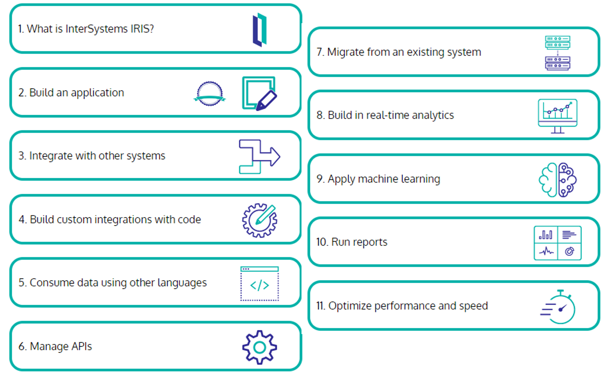

# インプリメンテーションパートナ向けInterSystems製品をはじめよう（全業種向け）

InterSystems IRIS® データプラットフォーム、利用可能なツール、InterSystems IRIS を使用したアプリケーションのセットアップと開発の基本について学習します。 

この学習プログラムは、InterSystems IRISを初めて導入する方を対象としています。

パートナーになることに興味がありますか？[インプリメンテーション・パートナー・プログラムの詳細](https://www.intersystems.com/jp/partners/implementation-partners/)をご覧ください。
※ 医療向けパスは削除されました・・

>オリジナル[Getting Started with InterSystems for Implementation Partners (All Industries)
Note](https://learning.intersystems.com/course/view.php?id=1809)
→　内容ほぼ同じらしいけどレイアウトが変わった： [Getting Started with InterSystems IRIS for Implementers](https://learning.intersystems.com/course/view.php?name=IRISImplProgram)

このラーニング・パスを終了することに加え、以下の講師付きクラスルームトレーニングコースに参加／個別開催の申し込みを行うことを強く推奨します。

- [InterSystems SQL](https://www.intersystems.com/jp/intersystems-sql/)
- [InterSystems Object](https://www.intersystems.com/jp/intersystems-object/)

    ※ このコースはObjectScriptを学習するコースではありません。
    
    ※ InterSystems製品でオブジェクト指向プログラミングを行う方法、また永続クラス定義の作成、オブジェクト操作方法を学習するためのコースです。
- [InterSystems Server システム管理1](https://www.intersystems.com/jp/intersystems-server-system-administration/)
- [InterSystems Server システム管理2：セキュリティ管理編](https://www.intersystems.com/jp/intersystems-server-system-administration-2/)

## **目次**
1. [InterSystems IRIS とは？](#1-intersystems-iris-とは)
2. [サーバサイドアプリケーションの構築](#2-サーバサイドアプリケーションの構築)
3. [他のシステムとの統合](#3-他のシステムとの統合)
4. [カスタムコンポーネントを使用したシステム統合の開発](#4-カスタムコンポーネントを使用したシステム統合の開発)
5. [他言語を使用したデータアクセス](#5-他言語を使用したデータアクセス)
6. [APIの管理](#6-apiの管理)
7. [既存システムからの移行](#7-既存システムからの移行)
8. [リアルタイム分析の構築](#8-リアルタイム分析の構築)
9. [機械学習の適用](#9-機械学習の適用)
10. [レポートの実行](#10-レポートの実行)
11. [パフォーマンスとスピードの最適化](#11-パフォーマンスとスピードの最適化)

## 1. InterSystems IRIS とは？

InterSystems IRIS®データ・プラットフォームは、信頼性の高い統一プラットフォームで、重要なアプリケーションを迅速に開発・配布することを可能にします。

- データ管理
- Interoperability（相互運用性）
- トランザクション処理
- 分析

[ビデオ（英語）InterSystems へようこそ](https://www.youtube.com/watch?v=v4uoejre5IU)

日本語字幕入りはこちら👉[What Is InterSystems IRIS?](https://learning.intersystems.com/course/view.php?id=2118)

もう少し詳しく確認されたい方は約30分の以下ビデオをご参照ください。

- InterSystems IRIS データプラットフォームのご紹介

    

## 2. サーバーサイドアプリケーションの構築

InterSystems IRIS で ObjectScript を使用して高性能なアプリケーションを構築する方法を学習することで以下の内容を開発できるようになります。

- ビジネスルールとメッセージルータのコードでカスタム関数を作成する。
- カスタムコードによる高度なデータ変換の作成
- カスタム・プロダクション・コンポーネントの構築
カスタム・ビジネス・コンポーネントの構築方法の詳細については[「カスタムコンポーネントを使用したシステム統合の開発」](#4-カスタムコンポーネントを使用したシステム統合の開発)をご参照ください。

### 1. はじめに

最初に、概要をビデオでご覧ください。その後、InterSystems IRIS® データプラットフォームのアーキテクチャとクラスの基本を学び、ObjectScript でのコーディングを開始します。

- InterSystems 製品のアーキテクチャ概要 ～ネームスペースとデータベース～

    
   

英語のみとなりますが、以下のオンラインコースもあります。

- [オンラインコース（英語）：Creating an InterSystems Class Definition in VS Code](https://learning.intersystems.com/course/view.php?name=IRIS%20Class)

- [オンラインコース（英語）:InterSystems ObjectScript Basics](https://learning.intersystems.com/course/view.php?name=Cach%C3%A9%20ObjectScript%20Basics)

- [オンラインコース（英語）:InterSystems IRIS Objects Introduction](https://learning.intersystems.com/enrol/index.php?id=2225)

- [オンラインコース（英語）：InterSystems SQL Overview](https://learning.intersystems.com/enrol/index.php?id=960)

- [オンラインコース（英語）:Using JSON in InterSystems IRIS](https://learning.intersystems.com/course/view.php?name=JSON%20in%20IRIS)

- [演習環境付き演習（オンラインコース）：Learning Path Exercise: Building a Server-Side Application with InterSystems IRIS](https://learning.intersystems.com/course/view.php?name=Server-Side%20Application%20Exercise)

    InterSystems IRIS® データプラットフォームと InterSystems ObjectScript を使用して、小規模なデータベースアプリケーションを作成します。
    
    この演習では、InterSystems IRIS を使用したサーバサイド・アプリケーションの構築の学習パスで学習したすべてのスキルを結集して、大規模な書籍コレクションに関する情報を格納および取得するためのクラスを作成し、SQL を使用します。
    
    この演習は、既存の知識をテストするために学習パスを開始する前に、またはキャップストーン・プロジェクトとして最後にお試しください。

#### 日本語：セルフラーニングビデオ

オンラインラーニングと内容は異なりますが、オリエンテーションに最適なセルフラーニングビデオやコンテンツをご用意しています。

以下動画から、IRISの開発環境の作成方法、ネームスペース／データベースについて、IDEからIRISに接続する方法を確認できます。
- [【はじめての InterSystems IRIS】セルフラーニングビデオ：基本その2：InterSystems IRIS で開発をはじめよう！](https://jp.community.intersystems.com/node/478601)

以下コンテンツから、ObjectScriptの基本操作を確認できます。
- [ObjectScript クックブック：ObjectScriptの基本のき！](https://github.com/Intersystems-jp/ObjectScriptCookBook/blob/master/Basic.md)

以下動画から、クラス定義の作成からインスタンス生成、保存までの流れを確認できます。
- [【はじめての InterSystems IRIS】セルフラーニングビデオ：基本その3：IRIS でクラス定義を作ろう（オブジェクト操作の練習）](https://jp.community.intersystems.com/node/478606)

InterSystems製品でのJSON操作については、以下記事をご参照ください。

-　[【はじめてのInterSystems IRIS】セルフラーニングビデオ：アクセス編：IRIS での JSON の操作](https://jp.community.intersystems.com/node/480106)

メソッド内でSQLを記述する方法については、以下のコンテンツをご参照ください。

- [ObjectScriptクックブック：7.メソッドやルーチンでSQLを実行する方法](https://github.com/Intersystems-jp/ObjectScriptCookBook/blob/master/Basic.md#7-%E3%83%A1%E3%82%BD%E3%83%83%E3%83%89%E3%82%84%E3%83%AB%E3%83%BC%E3%83%81%E3%83%B3%E3%81%A7sql%E3%82%92%E5%AE%9F%E8%A1%8C%E3%81%99%E3%82%8B%E6%96%B9%E6%B3%95)

対応する講師付きトレーニングコースもあります。

- [InterSystems Object（2日間）](https://www.intersystems.com/jp/intersystems-object/)

関連するトレーニングコースは以下の通りです。

- [InterSystems SQL（2日間）](https://www.intersystems.com/jp/intersystems-sql/)

#### 認定テスト受験の準備が整ったら

インターシステムズ・ラーニング・サービスは、業界標準の認定試験を提供し、あなたがインターシステムズの技術を習得していることを証明します。当社の試験は、安全なオンライン試験監督とセルフサービス予約で提供されます。受験者は、いつでもどこでも、都合のよいときに試験を受けることができます。

※英語のみ：[Exam: InterSystems IRIS Core Solutions Developer Specialist](https://www.intersystems.com/education/)

## 3. 他のシステムとの統合

多くの場合、データはフラット・ファイルかカスタム・フォーマットのどちらか送受信されます。このセクションでは、このようなデータを素早く取り込むことができる、ローコードまたはコード不要のユーティリティを紹介します。

- [体験環境付き演習：Receiving and Routing Data in a Production](https://learning.intersystems.com/course/view.php?name=Interop%20QS)

    ※ページ内のビデオは日本語切り替えができます。

    演習内容👉http://github.com/intersystems/Samples-Integration-RedLights

    ___
    《相談》Gitがあるから日本語README追加してもらって操作解説入れるとかはできるかもしれない。
    
    一応こんな日本語ページあり👉http://github.com/intersystems/Samples-Integration-RedLights

    ___

- [オンラインコース（英語）:Integration Architecture](https://learning.intersystems.com/course/view.php?id=908)

    InterSystems IRIS®データプラットフォーム、InterSystems HealthShare®、InterSystems Ensemble®の統合機能の基本的なアーキテクチャを学習します。
    
    これらのコンポーネントを通じてデータがどのように流れ、システム間の相互運用が可能になるかを学びます。

    このコースには、3 つのレッスンと数問のクイズが含まれています。ビデオはフルスクリーンモードでご覧ください。

    **上記内容をカバーできる日本語ビデオや記事をご用意しています**
    
    -InterSystems IRIS データプラットフォームのご紹介

        
   
    - シリーズ記事：[【はじめてのInterSystems IRIS】Interoperability（相互運用性）：動作の仕組みを知ろう](https://jp.community.intersystems.com/node/483036)

    - シリーズ記事：[【はじめてのInterSystems IRIS】Interoperability（相互運用性）：プロダクションとは](https://jp.community.intersystems.com/node/483041)

- ビデオ：レコードマップのご紹介

    InterSystems製品のInteroperability（相互運用性）メニューで使用できるファイル入出力処理に便利な機能のご紹介

    

    ご参考：[レコードマップで何ができるか？](https://jp.community.intersystems.com/node/494326)

- [ビデオ（英語）:Using the Complex Record Mapper](https://learning.intersystems.com/enrol/index.php?id=1426)
    

- [ビデオ（英語）Building BPL Business Processes (1h 30m)](https://learning.intersystems.com/enrol/index.php?id=2030)

    以下、関連する日本語記事もあります。

    - [【はじめてのInterSystems IRIS】Interoperability（相互運用性）：コンポーネントの作成（ビジネス・プロセス）](https://jp.community.intersystems.com/node/483171)

-　ビジネス・ルールエディタの使い方

    

    ※新エディタに未対応

- [オンラインコース（英語）:Data Transformations Basics](https://learning.intersystems.com/enrol/index.php?id=1170)

    グラフィカルな管理ポータル・インタフェースを使用して、データ変換を作成する方法を学びます。フィールドをマップする方法、フィールドを変更する関数を使用する方法、およびフィールドの値としてリテラルを使用する方法をご覧ください。最後に、変換をテストして実装する方法を学びます。

    >メモ：前提知識にHL7が含まれている。HL7で流れるデータを使って変換書いてる。HL7によってるので、医療以外の人には良くなさそう

    《相談》DTLを使うには良いと思うけど、HL7使わない人向けに何かオリジナルでビデオ解説＋説明＋サンプル作ったほうがいいかどうか。（DTL単体で作ってテストができるので部品としての紹介にはいいかもしれない）

## 4. カスタムコンポーネントを使用したシステム統合の開発
FHIR® HL7® V2 コンポーネントなど、多くのビルド済みビジネスコンポーネントが開発者に提供されています。

これだけでは不十分な場合は、カスタムコンポーネントを構築して、データの取り込み方法を完全にカスタマイズすることができます。

- Interoperabilityメニューで使用するカスタムメッセージクラス作成方法

    

    関連する日本語記事もあります。
    - [【はじめてのInterSystems IRIS】Interoperability（相互運用性）：メッセージ](https://jp.community.intersystems.com/node/483131)

- [オンラインコース（英語）：Building Custom Business Operations](https://learning.intersystems.com/course/view.php?name=Building%20Custom%20Business%20Operations)

- [オンラインコース（英語）:Building Custom Business Services (1h 30m)](https://learning.intersystems.com/enrol/index.php?id=2031)

    ※関連する日本語記事は以下の通りです。
    
    メモ：オンラインコースのほうが説明が浅く広い（HL7系の話も少し含まれてる）

    - [【はじめてのInterSystems IRIS】Interoperability（相互運用性）：コンポーネントの作成（ビジネス・オペレーション）](https://jp.community.intersystems.com/node/483136)
    - [【はじめてのInterSystems IRIS】Interoperability（相互運用性）：コンポーネントの作成（ビジネス・サービス）](https://jp.community.intersystems.com/node/483186)

- [オンラインコース（英語）:Setting Up RESTful Services](https://learning.intersystems.com/course/view.php?name=REST%20Services)

    APIファーストのステップで作るCoffee Maker API

    内容は異なりますが、日本語のセルフラーニングビデオ・記事は以下の通りです。

    - [【はじめてのInterSystems IRIS】セルフラーニングビデオ：アクセス編：（REST）APIファーストで作成するRESTディスパッチクラス](https://jp.community.intersystems.com/node/479596)

    - [REST経由で情報を入力する場合の Interoperability（相互運用性機能）のサンプル](https://jp.community.intersystems.com/node/559356)　

        ※この記事はAPIファーストで記載していませんが、直接呼出しのビジネス・サービス作成を補足する記事です。

- [ビデオ（英語）What is PEX?](https://learning.intersystems.com/enrol/index.php?id=1716)

    Production EXtension フレームワーク (PEX) を使用すると、ObjectScript を学習することなく、.NET または Java でカスタム相互運用性コンポーネントを構築できます。PEX を使用すると、使い慣れた言語でコーディングし、確立されたコードライブラリを活用して、プロダクションにコンポーネントを追加できます。PEX を使用してプロダクションを構築する方法については、オンラインコース（英語）[「Creating Interoperability Productions Using PEX」（1 時間）](https://learning.intersystems.com/course/view.php?name=PEXInteroperabilityProductions)を受講してください。

    《相談》ビデオもコースもないのでどうするか。（ビデオは日本語字幕付ける、はできる）

## 5. 他言語を使用したデータアクセス

InterSystems IRIS では、Java、Python、Node.js、.NET などの言語用の統合ツールを提供しています。

JDBC を使用して Java を使用するシステムと InterSystems IRIS を統合する方法をご覧ください。

- [ビデオ（英語／日本語字幕あり）Using JDBC with InterSystems IRIS](https://learning.intersystems.com/enrol/index.php?id=881)

    ※YouTubeにないのでMP4もらうこと

## 6. APIの管理
InterSystems API Manager が提供するツールを参照してください：

- クライアント側の開発者が利用可能な API のドキュメントを公開する
- 実行されたコールに関するメトリックの提供
- スロットリングやセキュリティの構築

- InterSystems API Manager のご紹介

    

    参考となる記事：[ゼロから使いこなす IAM（InterSystems API Manager）](https://jp.community.intersystems.com/node/493416)

- [ビデオ（英語）:Installing InterSystems API Manager](https://learning.intersystems.com/enrol/index.php?id=1726)

    InterSystems API Manager バージョン 1.5+ のインストール手順、InterSystems IRIS® データベース・プラットフォーム・インスタンスとホスト・システムの準備方法、および API Manager インストール・キットで提供されるスクリプトの実行方法について説明します。

    《相談と確認必要》※古いけど同じ方法なのか？（2024年1月19日時点：IAM 3.4）日本語字幕付けるほうがいいかどうか

- [演習環境付き演習（英語）:Hands-On with InterSystems API Manager for Developers](https://learning.intersystems.com/course/view.php?name=IAMExercise)

    InterSystems API Manager を使用して、InterSystems IRIS® データ・プラットフォーム内のコーヒー・メーカー・アプリケーションの API を管理します。

    前提学習または経験 コンテナと Docker の基本的な知識。REST と HTTP リクエスト・レスポンス・ステータス・コードの基礎知識

    《相談》バージョン古いけど、 [ゼロから使いこなす IAM（InterSystems API Manager）](https://jp.community.intersystems.com/node/493416)も演習資料みたいになってるので代用できないかどうか（現バージョンでも同じように使えるか確認は必要）
    

## 7. 既存システムからの移行
既存システムからの移行の検討が必要ですか？

- [ドキュメント：TSQLの移行の計画と実行](https://docs.intersystems.com/irisforhealthlatestj/csp/docbook/DocBook.UI.Page.cls?KEY=GTSQ_intro)

## 8. リアルタイム分析の構築
InterSystems IRISに組み込まれたInterSystems IRIS Business Intelligenceは、ほぼリアルタイムの分析を提供します。このデータを使って、ダッシュボードやピボットテーブルを作成し、スループットを分析したり、規制データを報告したりすることができます。レポート作成に関するリソースは、[「レポートの実行」](#10-レポートの実行)のセクションを参照してください。

- InterSystems IRIS Business Intelligence 概要

    
    

- InterSystems Business Intelligenceで使用するキューブ概要

    

- InterSystems IRIS Business Intelligence：アーキテクト画面の基本の使い方

    

- [ビデオ（英語）:InterSystems IRIS BI: Analyzer](https://learning.intersystems.com/course/view.php?name=IRISBIAnalyzer)

    関連ビデオ：[開発テンプレート（IRIS Analytics Template）の使い方のご紹介（第8回 InterSystems IRIS Analytics コンテスト）](https://jp.community.intersystems.com/node/484826)

日本語チュートリアル（11シリーズ）：[IRIS BI開発者向けチュートリアルを試してみる](https://jp.community.intersystems.com/node/563396)

## 9. 機械学習の適用
InterSystems IntegratedML は、SQL 開発者が、従来の専門知識やリソースを必要とせずに、機械学習のパワーを簡単に活用できるようにします。

InterSystems IRIS の SQL 環境に直接組み込まれた IntegratedML により、開発者はアプリケーションで予測モデルを作成、トレーニング、テスト、実行することができます。

- Integrated ML のご紹介～InterSystems IRISのAutoMLご紹介～

    

    より詳細を確認する場合のおすすめビデオは以下
    - [SQLから始める機械学習 ～　IntegratedMLのご紹介　～（2021年10月19日開催）](https://www.youtube.com/watch?v=3yLK9kBs4ic&list=PLzSN_5VbNaxC-z6_DKUZuO__zyudjLE-g&index=2)

    - [IntegratedMLとDataRobotの連携](https://www.intersystems.com/jp/integratedml-datarobot-demo/)

        ※この連携は今も有効なのか？

- [インフォグラフィック（英語）:Preparing Your Data for Machine Learning](https://learning.intersystems.com/course/view.php?name=Preparing%20Your%20Data)

    このインフォグラフィックは、データを準備するための基本的なステップと、IntegratedML がそのプロセスをどのように効率化できるかを示しています。データを準備することは、アプリで機械学習を活用するための重要なステップです。

    《相談》ここはどうすることもできない・・・・日本語化したページを用意してもらう？（できるか未確認）

- [インフォグラフィック（英語）:Common Supervised Machine Learning Algorithms](https://learning.intersystems.com/course/view.php?name=Machine%20Learning%20Algorithms)

    《相談》ここはどうすることもできない・・・・日本語化したページを用意してもらう？（できるか未確認）

    もしくは、インフォグラフィックのところ、堀田さんの以下ビデオで良いような？
    - [機械学習101（2023年11月29日開催　インターシステムズ開発者ウェビナー）](https://www.youtube.com/watch?v=47bP5-AtBVU&list=PLzSN_5VbNaxC-z6_DKUZuO__zyudjLE-g)

- [演習環境付き演習（英語）:Hands-On with IntegratedML](https://learning.intersystems.com/course/view.php?name=HandsOnIntegratedML)

    《相談》ここはチュートリアルでも良い気がする
    - [記事:機械学習を試せるチュートリアル：IntegratedML](https://jp.community.intersystems.com/node/537501)

## 10. レポートの実行
InterSystems Reports と InterSystems IRIS Adaptive Analytics は、レポートの作成、カスタマイズ、表示を可能にします。Adaptive Analyticsを使用することで、サードパーティのテクノロジーを簡単に接続し、さらなる分析を行うことができます。

- [ビデオ（英語）:Introduction to InterSystems Reports](https://learning.intersystems.com/enrol/index.php?id=1444)

    Logi Analytics が提供する InterSystems Reports は、データのビジュアルレポートを迅速に作成・表示できるレポート作成ツールです。このビデオでは、InterSystems Reports とそのコア・コンポーネントを紹介します。より詳細な情報については、Logi Report のドキュメントをご覧ください。

    《相談》字幕付けるかどうか

- [演習環境付き演習（英語）:Getting Started with InterSystems Reports](https://learning.intersystems.com/course/view.php?name=GettingStartedInterSystemsReports) 

    《相談》演習用PDFがあるのでこれを翻訳してラーニングパスから指したらできないこともない。作るかどうか[PDF](https://learning.intersystems.com/course/view.php?name=GettingStartedInterSystemsReports)

- [ビデオ（英語）:InterSystems IRIS Adaptive Analytics Overview](https://learning.intersystems.com/course/view.php?id=1754)

    《相談》これは岩本さんの説明ビデオは？ただ、ラーニングパスでは軽く見てほし（＝短い）という要素があれば、上に字幕を付けるしかないかも。

    - [InterSystems IRIS Adaptive Analyticsのご紹介（2021年10月12日開催）](https://www.youtube.com/watch?v=8j6iqmT13XI&list=PLzSN_5VbNaxBlWFxRfrrrScerJrpo7xjr&index=3)

- [オンラインコース（英語）：InterSystems IRIS Adaptive Analytics Essential](https://learning.intersystems.com/course/view.php?name=AdaptiveAnalyticsEssentials)

    《相談》試してもらえる環境が登場するので、画面翻訳で使ってください。でいいかもしれない。

## 11. パフォーマンスとスピードの最適化

アプリケーションのパフォーマンスを必要なだけ確保するためには、高性能なインジェストツールでシステムを構成するだけでなく、大量かつ高速なインジェストのためにシャーディングを設定し、フェイルオーバーのためにミラーリングを設定する必要があります。このセクションでは、これらの推奨事項の多くについて説明する。

- [ビデオ（英語）:InterSystems IRIS Speed Test: High-Volume Ingestion](https://learning.intersystems.com/enrol/index.php?id=1545)

    InterSystems IRIS®データ・プラットフォームの新しいオープン・ソース・ハイブリッド・トランザクション／アナリティカル・プロセッシング（HTAP）スピード・テスト・デモの使用方法をご紹介します。InterSystems IRIS が、リアルタイムのアプリケーション・クエリに答えながら、いかに大量のデータを取り込むことができるかをご覧いただけます。このビデオでは、HTAPスピードテストを使って、InterSystems IRISのパフォーマンスをMySQLやSAP HANAなどの他のデータベースと比較する方法を紹介しています。

    《相談》字幕付けるかどうか。結構長めのビデオ（20分弱）

- [ドキュメント：ミラーリングの構成](https://docs.intersystems.com/irislatestj/csp/docbook/DocBook.UI.Page.cls?KEY=GHA_MIRROR_SET_CONFIG)

- [ドキュメント：高可用性を実現するためのフェイルオーバー方法](https://docs.intersystems.com/irislatestj/csp/docbook/Doc.View.cls?KEY=GHA_failover)

- [オンラインコース（英語）:Introduction to Sharding in InterSystems IRIS](https://learning.intersystems.com/enrol/index.php?id=1181)

    InterSystems IRIS® データ・プラットフォームの水平スケーラビリティ機能であるシャーディングについて学び、この機能を使ってシステム・パフォーマンスを向上させる方法を学びます。このコースには、2 つの説明レッスンといくつかのクイズ問題が含まれています。ビデオはフルスクリーンモードでご覧ください。

    《相談》画面翻訳でお試しください、でいいかどうか。

- [オンラインコース（英語）:Sharding Basics: Planning and Deploying](https://learning.intersystems.com/course/view.php?name=Sharding%20Basics)

    シャーディングは、システムの水平スケーリングに効果的なアプローチです。InterSystems IRIS® データ・プラットフォームを使ってシャーディング・クラスターを計画し、展開する方法をご紹介します。

    このコースには、2つの説明レッスンといくつかのクイズ問題が含まれています。ビデオとシミュレーションはフルスクリーンモードでご覧ください。

    《相談》画面翻訳でお試しください、でいいかどうか。

- [ドキュメント：分散キャッシュによるユーザ数に応じた水平方向の拡張](https://docs.intersystems.com/irislatestj/csp/docbook/DocBook.UI.Page.cls?KEY=GSCALE_ecp)

## 12. What's next

If you would like to learn more, please see the resources below.

- For more resources built for InterSystems partners, see the Partner Hub.

    《相談》パートナーハブは日本で使ってるのかどうか

- To learn how to set up IRIS with Docker on your own machine, watch the Run IRIS Community Edition Using Docker video (3m). 

    《相談》 ここは以下コミュニティのビデオがある

    [InterSystemsコンテナレジストリの使い方とコンテナ開始までの流れ（解説ビデオ付き）](https://jp.community.intersystems.com/node/545786)

- InterSystems製品についての情報や質問は、[開発者コミュニティ](https://jp.community.intersystems.com/)まで

- If you need technical help with your solution, contact the WRC.

